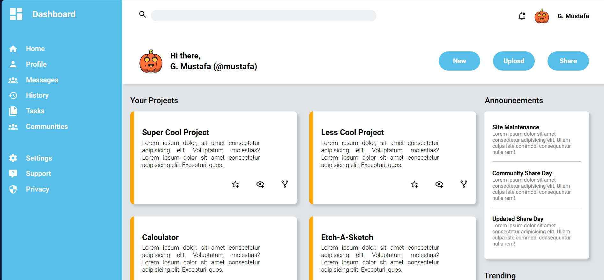

# Admin Dashboard

A responsive Admin Dashboard web application built with HTML and CSS. This project demonstrates a modern dashboard layout with sidebar navigation, header actions, project cards, announcements, and trending sections.

## Features

- **Sidebar Navigation:** Quick access to Dashboard, Home, Profile, Messages, History, Tasks, Communities, Settings, Support, and Privacy.
- **Header:** Includes a search bar, notification bell, user profile, welcome message, and action buttons (New, Upload, Share).
- **Projects Section:** Displays project cards with descriptions and action icons.
- **Announcements:** Shows important messages and updates.
- **Trending Section:** Highlights trending users and their projects.
- **Responsive Design:** Layout adapts to different screen sizes.
- **Custom Icons:** Uses local images for icons and avatars.

## Getting Started

1. **Clone or Download** this repository.
2. Make sure the `images` folder (with all required icons) is present in the project directory.
3. Open `index.html` in your web browser.

## File Structure

```
admin-dashboard/
│
├── index.html
├── styles.css
└── images/
    ├── magnify.png
    ├── bell.png
    ├── pumpkin.png
    ├── dashboard.png
    ├── home.png
    ├── profile.png
    ├── communities.png
    ├── history.png
    ├── tasks.png
    ├── settings.png
    ├── help.png
    ├── privacy.png
    ├── star.png
    ├── eye.png
    ├── branch.png
    ├── skeleton.png
    ├── ghost-custom.png
    └── ghost.png
```
## Screenshot

## Customization

- **Change User Info:** Edit the user name and profile image in `index.html`.
- **Add Projects:** Add or modify project cards in the Projects section.
- **Update Announcements/Trending:** Edit the right bar sections for new messages or trending users.

## Credits

- Design and code by G. Mustafa.
- Icons and images are local assets.

## License

This project is for educational and